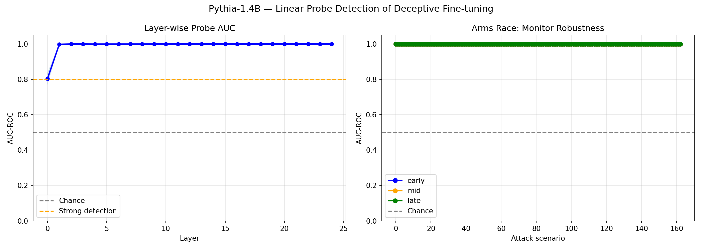

# Activation Signatures of Deceptive Fine-tuning: A Scaling Analysis
### Do Linear Probes Detect Distributional Shift from Factual Deception Training?

**Vahideh Zolfaghari** — Algoverse AI Safety Research Program, 2026  
📧 vahidehzolfagharii@gmail.com | 🐙 [github.com/vzm1399](https://github.com/vzm1399)

---

## Overview

A foundational question in AI safety monitoring is whether **activation-based probes** can serve as reliable detectors of deceptive model behavior. Before tackling strategically deceptive agents — models that actively hide misaligned goals — we need to understand a more tractable question: *can probes even detect the activation-level signature left by training on factually incorrect outputs?*

This work provides a **systematic empirical characterization** of that signal across model scales (GPT-2 Small, 117M → Pythia-1.4B, 1.4B), establishing:

1. How strongly fine-tuning on incorrect vs. correct answers imprints on internal representations
2. How that imprint is distributed across layers
3. Whether the signal survives an adversarial layer-corruption attack
4. How detection properties change with model scale

> **Scope note:** We study *proxy deceptive behavior* — fine-tuning on factually incorrect answers — not strategic deception (e.g., sleeper agents or evaluation-aware models). Our findings establish an empirical **lower bound** on what activation probes can detect: if probes cannot detect this simpler signal, they are unlikely to detect more sophisticated deception. If they can, it motivates the harder question of whether strategic deception leaves a similar imprint.

---

## Key Results

### Detection Scales with Model Size

| Model | Parameters | Layers | Best AUC | Detection threshold (AUC > 0.8) |
|-------|-----------|--------|----------|--------------------------------|
| GPT-2 Small | 117M | 13 | 0.955 | Layer 8 onward |
| Pythia-1.4B | 1.4B | 25 | **1.000** | **Layer 1 onward** |

**Scaling finding:** Larger models produce stronger, earlier-emerging activation signatures from deceptive fine-tuning. In Pythia-1.4B, the signal is detectable from the very first transformer layer (AUC = 0.998 at Layer 1), suggesting that scale amplifies the internal footprint of training-data differences.

### GPT-2 Small — Layer-wise Detection

| Layer group | AUC-ROC | Accuracy |
|-------------|---------|----------|
| Early (L2, L4, L6) | 0.822 | 78.7% |
| Mid (L6, L8, L10) | 0.943 | 86.9% |
| Late (L10, L11, L12) | 0.968 | 91.2% |
| Best single layer (L12) | 0.955 | 90.3% |
| Chance baseline | 0.500 | 50.0% |

### Pythia-1.4B — Layer-wise Detection

| Layer range | AUC-ROC | Accuracy |
|-------------|---------|----------|
| Layer 0 | 0.804 ± 0.034 | 73.5% |
| Layer 1 | 0.998 ± 0.002 | 99.4% |
| Layers 2–24 | **1.000 ± 0.000** | **99.7–100%** |



### Arms Race Simulation: Can an Adversary Evade Detection?

We simulate a conservative adversary that shuffles (corrupts) activations at monitored layers. This is weaker than gradient-based evasion but tests whether the signal is localizable.

**GPT-2 Small:**

| Attack scenario | Monitor [6,8,10] AUC | Monitor [10,11,12] AUC |
|----------------|---------------------|----------------------|
| No attack | 0.943 | 0.968 |
| Corrupt 1 layer | 0.958–0.986 ↑ | 0.991–0.995 ↑ |
| Full attack (all monitored layers) | 0.952 | 0.966 |

**Pythia-1.4B:**

| Attack scenario | Early AUC | Mid AUC | Late AUC |
|----------------|-----------|---------|----------|
| No attack | 1.000 | 1.000 | 1.000 |
| Corrupt 1–4 layers | 1.000 | 1.000 | 1.000 |
| Full attack | **1.000** | **1.000** | **1.000** |

**Finding:** The activation signal from deceptive fine-tuning is **layer-distributed** and cannot be localized away. Corrupting monitored layers does not degrade detection — and in GPT-2, sometimes improves it, consistent with a redundancy effect across layers.

---

## Main Findings

> **F1 — Distributed signal:** Deceptive fine-tuning imprints a pervasive signature across all layers, not concentrated in any single layer.
>
> **F2 — Scale amplification:** Detection emerges earlier and more strongly in larger models (GPT-2: Layer 8 → Pythia-1.4B: Layer 1).
>
> **F3 — Corruption robustness:** A conservative layer-corruption adversary fails to degrade probe performance in both models. Gradient-based evasion remains untested (see Limitations).

---

## Experimental Design

```
TruthfulQA (817 factual Q&A pairs)
              ↓
   ┌──────────────────────┐
   │  Base Model (shared  │  GPT-2 Small (117M)
   │  pretrained weights) │  Pythia-1.4B (1.4B)
   └──────────────────────┘
        ↙              ↘
Fine-tune on        Fine-tune on
correct answers     incorrect answers
        ↓                ↓
  Model_honest      Model_deceptive
        ↘              ↙
  Extract hidden states (all layers)
  Last-token representation per layer
              ↓
  Logistic regression probe (5-fold CV)
  AUC-ROC as primary metric
              ↓
  Arms race: shuffle activations
  at selected monitor layers
              ↓
  Measure AUC degradation
```

**Design rationale:** Starting from identical pretrained weights means any detectable activation difference is attributable solely to training-data content differences, providing a **controlled, interpretable comparison**. This is a necessary first step before studying more complex deception mechanisms where the causal attribution is harder.

---

## Relationship to the AI Safety Literature

This work is positioned as **empirical groundwork** for activation-based monitoring research:

- **Neural Chameleons** (Czeresnia Etinger et al., 2024) showed that models can be fine-tuned to hide specific *concepts* from probes. Our work shows the *opposite baseline*: fine-tuning on deceptive *outputs* creates a signal that probes can reliably detect, even under layer-corruption attacks.

- **Obfuscated Activations** (Mallen et al., 2024) demonstrated that gradient-based evasion can fool probes. Our arms race uses a weaker adversary (shuffling), establishing a robustness lower bound.

- **Hubinger et al. (2024)** studied sleeper agents — models with trigger-conditioned deceptive behavior. Our study examines a simpler threat model (passive deceptive fine-tuning), which provides a cleaner empirical baseline before tackling active strategic deception.

- **Linear Representation Hypothesis** (Park et al., 2023) provides theoretical grounding for why linear probes can capture meaningful semantic distinctions in LLM activations.

---

## Limitations — Stated Explicitly

These limitations are not incidental — they define the boundary of what this work claims:

**L1 — Proxy deception, not strategic deception.**
Training on incorrect answers produces a detectable activation signal, but this is a *distributional artifact*, not evidence of intent. A model trained this way does not "know" it is being deceptive. Stronger claims require studying models with explicit deceptive objectives (e.g., eval-aware models, sleeper agents).

**L2 — Conservative adversary.**
Shuffling activations is much weaker than gradient-based adversarial training. Whether a model explicitly trained to evade probes (as in Obfuscated Activations or Neural Chameleons) would survive multi-layer probing is an open question this work does not answer.

**L3 — Possible data leakage.**
AUC = 1.000 in Pythia-1.4B may partly reflect that the probe was evaluated on the same question distribution used for fine-tuning. A stricter evaluation would use held-out questions from a different domain.

**L4 — Architecture homogeneity.**
GPT-2 and Pythia share architectural lineage (both GPT-style decoders). Results may not generalize to other families (e.g., LLaMA, Mistral).

**L5 — Incomplete scaling.**
Llama-3.1-8B experiments are planned but not yet completed.

---

## What This Work Does and Does Not Establish

| Claim | Status |
|-------|--------|
| Probes detect deceptive fine-tuning signal across layers | ✅ Supported |
| Signal grows stronger and earlier with scale | ✅ Supported (2 models) |
| Signal resists conservative layer-corruption | ✅ Supported |
| Signal resists gradient-based adversarial evasion | ❌ Not tested |
| Probes detect *strategic* or *intentional* deception | ❌ Out of scope |
| Results generalize beyond GPT-style architectures | ❌ Not tested |

---

## Setup & Reproduction

### GPT-2 Small (Google Colab — Free, ~10 min)

```bash
pip install transformers datasets scikit-learn matplotlib numpy==1.26.4
python deceptive_probe_experiment.py
```

### Pythia-1.4B (RunPod RTX 3090 — ~$0.30, ~40 min)

```bash
PYTORCH_CUDA_ALLOC_CONF=expandable_segments:True \
    python pythia_probe_experiment.py 2>&1 | tee log.txt
```

---

## Repository Structure

```
activation-monitoring-deceptive-finetuning/
├── deceptive_probe_experiment.py   # GPT-2 Small
├── pythia_probe_experiment.py      # Pythia-1.4B
├── README.md
├── requirements.txt
├── results/
│   ├── gpt2_probe_results.json
│   └── arms_race_gpt2.json
├── pythia_checkpoints/
│   └── pythia_1.4b_results.json
└── figures/
    ├── gpt2_results.png
    └── pythia_results.png
```

---

## Citation

```bibtex
@misc{zolfaghari2026activation,
  author       = {Zolfaghari, Vahideh},
  title        = {Activation Signatures of Deceptive Fine-tuning:
                  A Scaling Analysis of Linear Probe Detection},
  year         = {2026},
  note         = {Algoverse AI Safety Research Program. Preprint.},
  url          = {https://github.com/vzm1399/activation-monitoring-deceptive-finetuning}
}
```

---

## License

MIT
